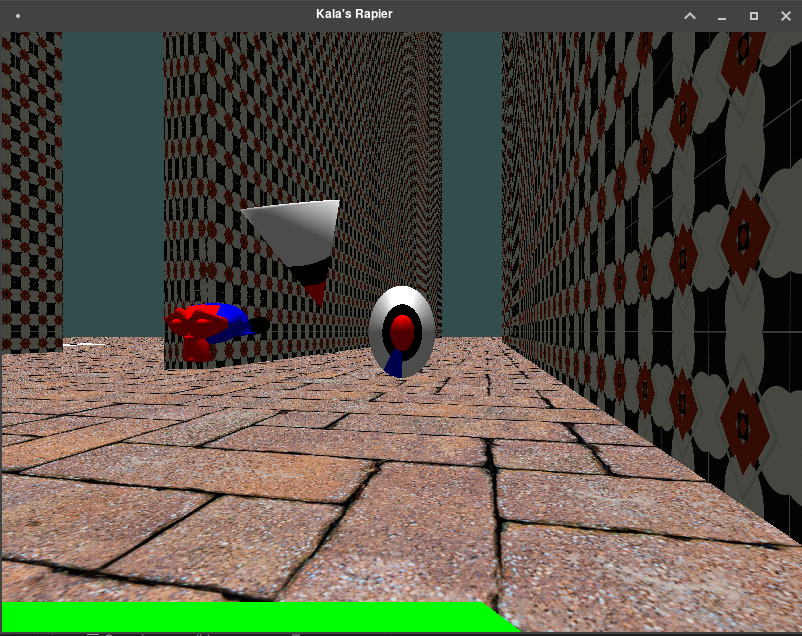
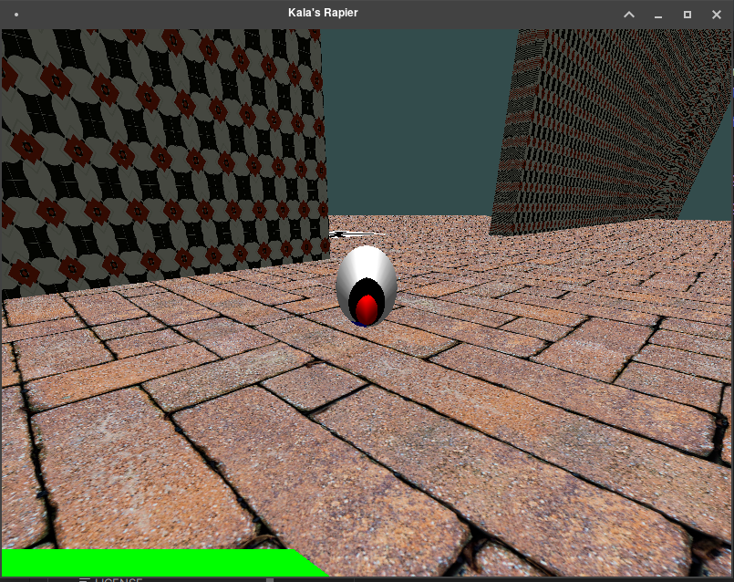
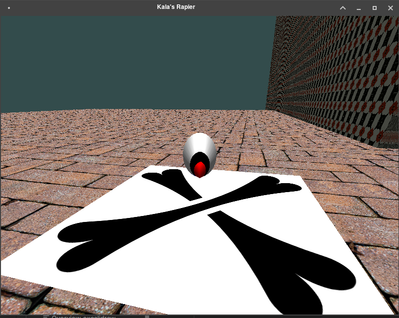

= OpenTK: Third Activity
Eleazar Díaz Delgado <eleazardzdo@gmail.com>
:source-highlighter: pygments
:icons: font

== Introduction

This last phase of the project shows how a simple game can be made with our custom engine.

So, let's start with an overview of how this engine operates. We divide the source code in two main folders `Game` and `Engine`. The `Game` folder is where our game is coded, as also serves as an example to explore the engine API.

It is compose of three simple concepts:

- GameManager: serves as the main entry for the game, where resources get loaded.
- Actors: It allows to improve the behavior of the base `Actor` class.
- Renderer Pipeline: Filters actors to be rendered. The rendering is up to the game creator, by taking in consideration the components of each actor.

To understand how the engine works, we are going to zoom over how the component system work with the actors.

== Component System

A component is an object that will be attached to the Actor via its Type, and will hold a reference to this actor.

[source,csharp]
----
public abstract class Component
{
    public Actor Actor { get; private set; }
    // ... details omitted
}

public class Actor
{

    private Dictionary<Type, Component> Components { get; set; } = new();
    // ...

    public T? GetComponent<T>() where T: Component { ... }

    public void AddComponent(Component component) { ... }
    //...
}
----

One may ask, how this get translated to our previous JSON format? To solve this question, we introduce a new object `ComponentData` those will hold the configuration data of each component to its successful creation.

[source,csharp]
----
public abstract class ComponentData
{
    public abstract Component BuildComponent(Actor actor);
}
----

But, we reach another problem: Serialization. We have several components that may not require data initial data or their fields are equals to other components. Making them indistinguishable from each other. To solve this problem, we introduce the concept of **Type Discriminator** to our JSON format.

[source,csharp]
----
[JsonDerivedType(typeof(MeshRef), typeDiscriminator: "Mesh")]
[JsonDerivedType(typeof(DirectionalLightData), typeDiscriminator: "DirectionalLight")]
// ... more components
----

This gives a new JSON format for our actors:

[source,json]
----
{
  "tag": "pawn",
  "enabled": true,
  "scale": [1, 1, 1],
  "position": [1, 0, 0],
  "orientation": {
    "axis": [1, 0, 0],
    "angle": 0
  },
  "children": [],

  "components": [
    {
      "$type": "Mesh",
      "mesh_id": "pawn"
    },
    {
      "$type": "BoxCollider"
    },
    {
      "$type": "Material",
      "material_id": "pawn_material"
    }
  ]
}
----

This way each component get identified by the tag `$type`. This system also allows to define actors that won't be rendered as meshes, but can carry other meanings like lights, cameras, trigger boxes...

[source,json]
----
{
  "tag": "DIRECTIONAL_LIGHT",
  "enabled": true,
  "position": [0, 0, 0],
  "orientation": {
    "axis": [1, 0, 0],
    "angle": 0
  },
  "components": [
    {
      "$type": "DirectionalLight"
    }
  ]
},
----

== Collision Detection

The collision is tightly integrated into the engine, it isn't just simple component. The actor class support it through specific methods.

[source,csharp]
----
public class Actor
{
    //...

    public virtual void OnTriggerEnter(Actor actor)
    {
    }

    public virtual void OnTriggerStay(Actor actor)
    {
    }

    public virtual void OnTriggerExit(Actor actor)
    {
    }
----

Those methods get called if the actor has one of the colliders: `BoxCollider`, `SphereCollider` and `PointCollider` Although, the only working is `BoxCollider` due to a minor limitation on the component system, fixable.

All the collision checking is done on the `CollisionManager`. There, the colliders get scaled and translated without need new recalculations.

[source,csharp]
----
    private static bool CheckCollisionAabb(BoxCollider collider1, BoxCollider collider2)
    {
        var actor1 = collider1.Actor;
        var actor2 = collider2.Actor;

        var translation1 = actor1!.GetWorldTransform().ExtractTranslation();
        var scale1 = actor1.GetWorldTransform().ExtractScale();
        var translation2 = actor2!.GetWorldTransform().ExtractTranslation();
        var scale2 = actor2.GetWorldTransform().ExtractScale();

        var actorBox1 = collider1.BoundingBox.ApplyScaleAndTranslate(scale1, translation1);
        var actorBox2 = collider2.BoundingBox.ApplyScaleAndTranslate(scale2, translation2);

        return CollisionLess(actorBox1.Min, actorBox2.Max) && CollisionLess(actorBox2.Min, actorBox1.Max);
    }
----

== Game

The game allows you to control the pawn cone painted with several materials. And move the camera around him, like a third person game.

[source,csharp]
----
public override void Update(double deltaTime)
{
    _controller!.UpdateState(Director.Window);

    var movement = _controller.GetMovement();
    // We move to whatever the camera is facing, but only in yaw.
    _currentPosition += (float)deltaTime * (_yawRotation * Utils.Forward * -movement.Z);

    var angles = _controller.GetArmDirection() / 500f;

    // We accumlated the rotations of each axis.
    _yawRotation *= Quaternion.FromAxisAngle(Vector3.UnitY, MathHelper.DegreesToRadians(angles.X));
    _pitchRotation *= Quaternion.FromAxisAngle(Vector3.UnitX, MathHelper.DegreesToRadians(angles.Y));
    var rotation = _yawRotation * _initialRotation * _pitchRotation;

    var rot = Matrix4.CreateFromQuaternion(_yawRotation);
    Transform = rot * Matrix4.CreateTranslation(_currentPosition);

    var cameraPos = _currentPosition + rotation * new Vector3(0, 0, _cameraDistance);
    _camera!.Actor.Transform = 
        Matrix4.CreateFromQuaternion(rotation) * Matrix4.CreateTranslation(cameraPos);
    }
----

To take generate the collisions, we reduce the speed to give the feel of a "collision". But, this would allow to go through walls, if you are willing to. 

[source,csharp]
----
public override void OnTriggerEnter(Actor actor)
{
    if (actor.Tag == "mark_trigger")
    {
        Console.WriteLine("Reached");
    }

    // The idea would be to implement a FixedUpdate, with its rigidbody fully controlled with physics
    // But! For the time being, we just go by: If you are confident enough, you can go through walls.
    _controller!.Speed = 0.5f;
}

public override void OnTriggerExit(Actor actor)
{
    _controller!.Speed = Speed;
}

----

The idea, is to reach the end of the maze before the time runs out. So, where is the timer? That's our green bar at the bottom of the screen.

To implement it, we create a new "Renderer Pipeline": `TimerPipeline`. This is in charge of only rendering the timer bar. 

To simplify the process we just generate the mesh on the fly inside the vertex shader.

[source,glsl]
----
void main() {
    vec3 position = vec3(0.0);
    
    position.x = floor(gl_VertexID / 2.0) / 10 - 1;
    position.y = mod(gl_VertexID, 2.0) / 10 -1;
    
    gl_Position = vec4(position, 1.0);
}
----

With this, we only need to specify how many triangle we want to draw, and the shader will do the rest.

[source,csharp]
----
    public override void Render(IEnumerable<Actor> actors, Director director)
    {
        GL.FrontFace(FrontFaceDirection.Cw);
        Shader.Use();

        GL.DrawArrays(PrimitiveType.TriangleStrip, 0, (int)(_timerPawn.Percentage * max));
        
        GL.FrontFace(FrontFaceDirection.Ccw);
        Utils.CheckGlError("Draw Timer");
    }
----

Reaching the end of the maze, we will show a simple message through the console.

To know when the user reaches this point, we use a BoxCollider with no mesh to trigger the event.

[source,json]
----
{
  "tag": "mark_trigger",
  "enabled": true,
  "scale": [3, 1, 3],
  "position": [-40, 0, -30],
  "orientation": {
    "axis": [1, 0, 0],
    "angle": 0
  },
  "components": [
    {
      "$type": "BoxCollider",
      "AutoGenerate": false,
      "Min": [-1, -1, -1],
      "Max": [1,1, 1]
    }
  ]
}
----

