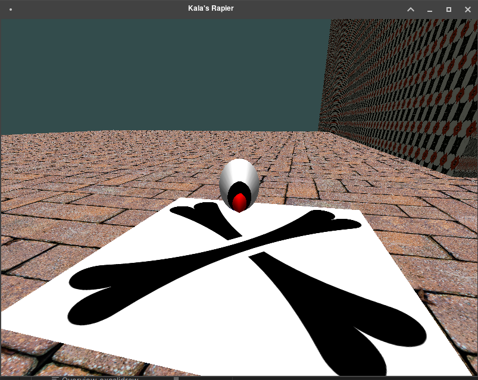

= Activity: Apply Pattern Designs
Eleazar Díaz Delgado <eleazardzdo@gmail.com>
:source-highlighter: pygments
:icons: font

== Introduction

Over the original design we have changed almost everything. But, there three main patterns that improve the final design.

So, let's starts from easiest to hardest:

== Game Loop

This cames for free, as it is implemented by OpenTK framework. You can find about how it works on `GameManager.cs`

The update loop, where logic goes:

[source,csharp]
----
private void WindowOnUpdateFrame(FrameEventArgs obj)
{
    var input = _window!.KeyboardState;
    if (input.IsKeyDown(Keys.Escape))
    {
        _window.Close();
    }

    _world!.Update(obj.Time);
}
----

Where the render, do its stuff.

[source,csharp]
----
private void WindowOnRenderFrame(FrameEventArgs e)
{
    _imGuiController?.Update(_window!, (float)e.Time);

    // Render
    _world!.Render();

    _imGuiController?.Render();
    Utils.CheckGlError("End of frame");
    _window!.SwapBuffers();
}
----

== Update Method

Given our render and logic loop being setup, we delegates the implementation details of those to each actor active in the scene. See more on `Director.cs`

[source,csharp]
----
public void Update(double deltaTime)
{
    foreach (var actor in ActorManager.GetActors().Where(actor => actor.Enabled))
    {
        actor.Update(deltaTime);
    }
}
----

For the render side, we have some specialized objects to manage some kind of rendering. Those are mean to be configured by the user. So, they could filter actors and decide which shaders apply with their configurations.

[source,csharp]
----
public void Render()
{
    foreach (var renderPipeline in _renderPipelines)
    {
        renderPipeline
            .Render(
                ActorManager.GetActors()
                    .Where(actor =>
                        actor.Enabled && renderPipeline.BelongsToPipeline(actor)), this);
    }
}
----

== Component

And finally, the component based approach. The "game engine" is a container of actors which can interact between them. Those have components associates, à la Unity in a simplied way.

A component, is an object with an actor reference. And that's it.

[source,csharp]
----
public abstract class Component
{
    public Actor Actor { get; private set; }
    // ... Details omitted
}
----

From this, each subclass will add the required properties and methods depending on their needs. Examples are `Camera.cs`, `Material.cs`, `DirectionalLight.cs`, `Collider.cs` and more.

How is this linked into an Actor? Let's take a look at `Actor.cs`

[source,csharp]
----
public class Actor
{
    // ... Details omitted
    private Dictionary<Type, Component> Components { get; set; } = new();

    // ...
----

We hold a hashmap of components using their type as a key. And, supply some nice methods to work with it.

[source,csharp]
----
    public T? GetComponent<T>() where T: Component
    {
        if (Components.TryGetValue(typeof(T), out var component)) {
            return component as T;
        }
        else {
            return null;
        }
    }

    public void AddComponent(Component component)
    {
        component.SetActor(this);
        Components.Add(component.GetType(), component);
    }
}
----

At the end, the actors become lighter to work with. Less populated with methods, as they become decouple from specific interactions that wouldn't suit all kind of actors if there were all integrated together.

[source,csharp]
----
var mesh = actor.GetComponent<Mesh>();
var renderer = actor.GetComponent<DefaultRenderer>();
var material = actor.GetComponent<Material>();
----

== Screenshots

image::start.png[]
image::game.png[]

